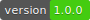

Overview
========

## BeMap API for JavaScript Developer's Guide

This documentation introduces the BeNomad BeMap API for JavaScript, offers a quick start guide, followed by a developer's guide with articles showing the implementation of typical use cases, and ends with a detailed API reference.

The overview (this chapter):

* defines the API
* outlines the key benefits of the API for developers
* explains the modular organization of the API


## What is the BeMap API for JavaScript?

The BeNomad BeMap API for JavaScript (also referred to as the BeMap JS API in the following text) is a set of programming interfaces that enable developers to build Web applications with feature rich, interactive BeNomad BeMap at their center. The API consists of libraries of classes and methods with which to implement the functionality of an interactive application.

## Why use the BeMap API for JavaScript?

The BeMap API for JavaScript offers the following high level features and benefits to developers of Web applications with maps as a core element:

Table 1. Main features of the BeMap API for JavaScript

## Browser Support

The BeMap JS API is built specifically for modern browsers that support HTML5 on desktop as well as mobile environments. Although it is optimized for certain browsers and environments, we do our utmost to ensure the API can be used on a wide variety of platforms and browsers.

Below is a list showing support (with and without optimizations) in the BeMap JS API for different browsers and environments:

```
{"bemap":{"language":"mermaid","graphid":"mermaidChart0"}}
graph TD;
webApp[Your web application]-- request -->BeMap[BeNomad BeMap server]
BeMap-- response -->webApp;
```





